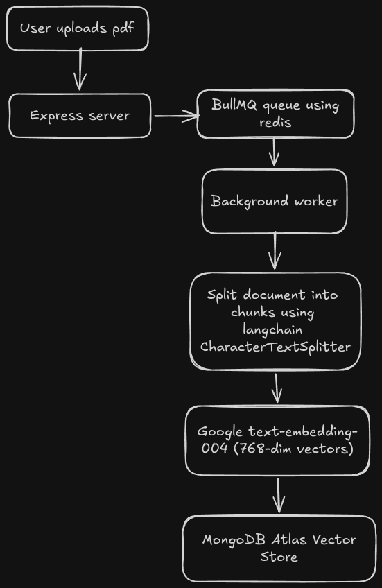
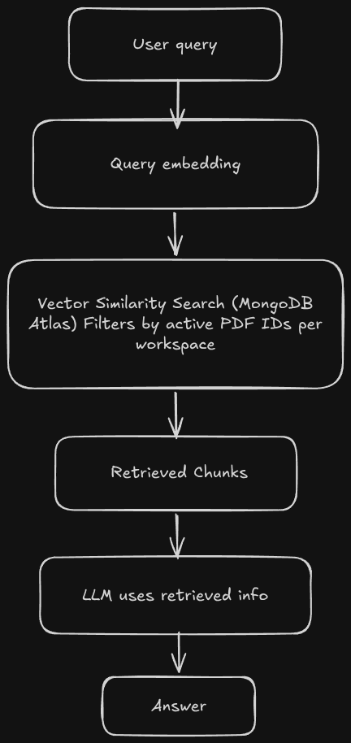

<div align="center">

# 📄 PaperWise

### _Chat with your PDFs using the power of AI_

[](https://nodejs.org/)
[](https://react.dev/)
[](https://www.mongodb.com/atlas)
[](https://ai.google.dev/)
[](https://www.langchain.com/)
[](https://redis.io/)

**PaperWise** is a full-stack, AI-powered document intelligence platform that lets users upload PDF documents and have natural, context-aware conversations with them. Built on a production-grade **RAG (Retrieval-Augmented Generation)** pipeline, it extracts precise answers, page references, and key insights directly from your documents — in seconds.

[✨ Features](#-features) · [🎬 Demo](#-demo) · [🏗️ Architecture](#️-architecture) · [🚀 Getting Started](#-getting-started) · [📡 API Reference](#-api-reference) · [🧩 Tech Stack](#-tech-stack)

</div>

---

## 🎬 Demo

> 📹 **Demo video coming soon!**
>
> <!-- DEMO VIDEO PLACEHOLDER -->
> <!-- To add your demo: replace this comment block with the following (remove the backticks):
>
> [](https://www.youtube.com/watch?v=YOUR_VIDEO_ID)
>
> OR if using a local video/GIF:
> 
>
> -->

---

## ✨ Features

| Feature | Description |
|---|---|
| 📂 **Workspace Management** | Organize PDFs into isolated workspaces — like project folders for your documents |
| ⚡ **Async PDF Ingestion** | Non-blocking upload pipeline using BullMQ + Redis; the UI stays responsive while documents are processed in the background |
| 🧠 **RAG-Powered Q&A** | Semantic vector search retrieves the most relevant document chunks before passing context to the LLM |
| 🔍 **Source Citations** | Every AI answer includes the filename, page number, and line reference from which it was derived |
| 💬 **Persistent Chat History** | Full conversation history stored per-workspace in MongoDB, survives page refreshes |
| 🔐 **JWT Authentication** | Stateless, secure auth with bcrypt password hashing and 7-day token expiry |
| 📝 **Markdown Rendering** | AI responses are rendered as rich, formatted Markdown with `react-markdown` + `remark-gfm` |
| 📱 **Responsive UI** | Built with React 19 + Tailwind CSS v4; works seamlessly on desktop and mobile |

---

## 🏗️ Architecture

PaperWise is engineered around two core pipelines:

### Pipeline 1 — PDF Ingestion



### Pipeline 2 — AI Chat (RAG)



---

## 🧩 Tech Stack

### Backend
| Technology | Role |
|---|---|
| **Node.js + Express 5** | REST API server |
| **LangChain + LangChain Community** | PDF loading, text splitting, vector store abstraction |
| **Google Gemini 2.5 Flash** | LLM for answer generation |
| **Google text-embedding-004** | 768-dimensional text embeddings |
| **MongoDB Atlas Vector Search** | Semantic similarity retrieval |
| **BullMQ + Upstash Redis** | Asynchronous job queue for PDF ingestion |
| **Mongoose** | MongoDB ODM, schema modeling |
| **Multer** | File upload middleware |
| **JWT + bcryptjs** | Authentication and password hashing |

### Frontend
| Technology | Role |
|---|---|
| **React 19** | UI framework |
| **Vite 7** | Build tool & dev server |
| **Tailwind CSS v4** | Utility-first styling |
| **React Router v7** | Client-side routing |
| **react-markdown + remark-gfm** | Markdown rendering for AI responses |
| **Lucide React** | Icon library |
| **react-hot-toast** | Toast notifications |

## 🚀 Getting Started

### Prerequisites

- Node.js v18+
- A MongoDB Atlas account (with Vector Search index enabled)
- An Upstash Redis instance
- A Google AI API key (for Gemini + Embeddings)

### 1. Clone the repository

```bash
git clone https://github.com/your-username/paperwise.git
cd paperwise
```

### 2. Configure the server

```bash
cd server
cp .env.example .env
```

Fill in your `.env`:

```env
PORT=8000
MONGODB_URI=mongodb+srv://<user>:<password>@<cluster>.mongodb.net/PaperWise
JWT_SECRET=your_jwt_secret_here
FRONTEND_URL=http://localhost:5173

# Upstash Redis
REDIS_URL=rediss://<your-upstash-url>

# Google AI
GOOGLE_API_KEY=your_google_ai_api_key
GEMINI_API_KEY=your_gemini_api_key
```

Install dependencies and start:

```bash
npm install
npm run server   # starts with nodemon
```

### 3. Configure the client

```bash
cd ../client
npm install
npm run dev
```

### 4. MongoDB Atlas Vector Search Index

In your MongoDB Atlas UI, create a vector search index on the `PaperWise.pdf_chunks_emb` collection:

```json
{
  "fields": [
    {
      "type": "vector",
      "path": "embedding",
      "numDimensions": 768,
      "similarity": "cosine"
    },
    {
      "type": "filter",
      "path": "metadata.pdfId"
    }
  ]
}
```

> **Index Name:** `vector_index`

---

## 📡 API Reference

### Authentication — `/auth`

| Method | Endpoint | Description |
|--------|----------|-------------|
| `POST` | `/auth/signup` | Register a new user |
| `POST` | `/auth/login` | Login and receive JWT token |
| `GET` | `/auth/me` | Get current user info (protected) |

### Workspaces — `/workspaces`

| Method | Endpoint | Description |
|--------|----------|-------------|
| `GET` | `/workspaces` | List all workspaces for the user |
| `POST` | `/workspaces` | Create a new workspace |
| `GET` | `/workspaces/:id` | Get workspace details + PDFs |

### PDFs — `/workspace/:workspaceId/pdfs`

| Method | Endpoint | Description |
|--------|----------|-------------|
| `GET` | `/workspace/:id/pdfs` | List PDFs in a workspace |
| `POST` | `/workspace/:id/pdfs` | Upload a new PDF (triggers async ingestion) |

### Chat — `/workspace/:workspaceId/chats`

| Method | Endpoint | Description |
|--------|----------|-------------|
| `GET` | `/workspace/:id/chats` | Retrieve chat history |
| `POST` | `/workspace/:id/chats` | Send a query → triggers full RAG pipeline |

**Chat request body:**
```json
{
  "query": "What are the key conclusions of the paper?",
  "activePdfs": ["pdf_id_1", "pdf_id_2"]
}
```

**Chat response:**
```json
{
  "newMessages": [
    { "role": "user", "content": "What are the key conclusions...", "createdAt": "..." },
    { "role": "assistant", "content": "## 📝 Answer:\n...\n## 📄 Reference:\n...", "createdAt": "..." }
  ]
}
```

---

## 🔐 Security

- Passwords hashed with **bcryptjs** (salt rounds: 10)
- All protected routes validate a **JWT Bearer token** via `protectMiddleware`
- All database queries are **user-scoped** — users can only access their own data
- File uploads are stored with **randomized filenames** to prevent path collisions


<div align="center">

Built with ❤️ using **LangChain**, **Google Gemini**, and **MongoDB Atlas**

</div>
