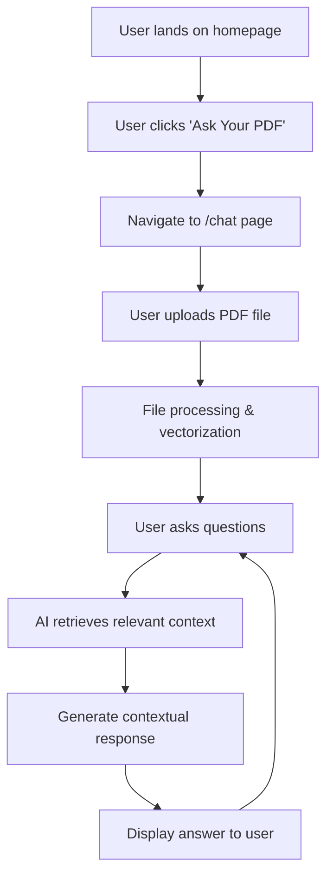
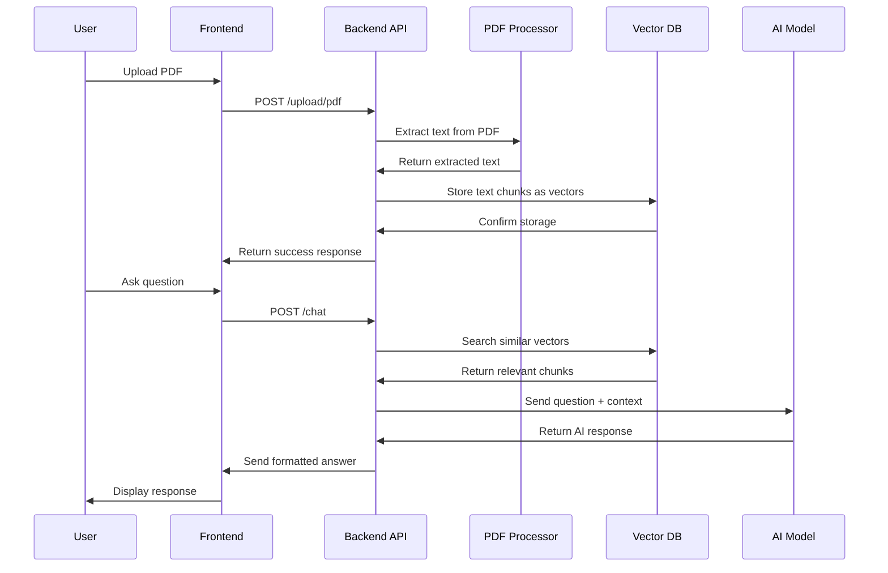

# PaperWise 📄🤖

> **Talk to Your PDFs, Get Instant Answers**

PaperWise is an intelligent AI-powered RAG (Retrieval-Augmented Generation) application that revolutionizes how you interact with PDF documents. Upload any PDF document and engage in natural conversations to extract insights, get summaries, find specific information, and ask complex questions about your documents.


## 🌟 Features

- **🔄 Intelligent PDF Processing**: Advanced document parsing and text extraction
- **💬 Natural Language Conversations**: Chat with your PDFs using natural language
- **⚡ Real-time Responses**: Get instant, contextually accurate answers
- **🎯 Precise Information Retrieval**: AI-powered semantic search through your documents
- **📱 Responsive Design**: Works seamlessly across desktop and mobile devices
- **🔐 Secure Authentication**: User authentication and session management
- **📊 Progress Tracking**: Real-time upload progress and processing status
- **🎨 Modern UI/UX**: Clean, intuitive interface with smooth animations

## 🚀 How It Works

### User Journey Flow



## 🏗️ Technical Architecture

### Backend Flow Diagram



### System Components

1. **Frontend (Next.js)**
   - User interface and interactions
   - File upload handling with progress tracking
   - Real-time chat interface
   - Authentication management

2. **Backend API (Node.js/Express)**
   - PDF processing and text extraction
   - Vector embedding generation
   - Similarity search operations
   - AI model integration

3. **Vector Database**
   - Document embedding storage
   - Semantic similarity search
   - Efficient retrieval operations

4. **AI Integration**
   - Large Language Model for responses
   - Contextual answer generation
   - RAG (Retrieval-Augmented Generation)

## 🛠️ Tech Stack

### Frontend Technologies
| Technology | Purpose | Version |
|------------|---------|---------|
| **Next.js** | React Framework | 15.3.5 |
| **React** | UI Library | ^19.0.0 |
| **TypeScript** | Type Safety | Latest |
| **Tailwind CSS** | Styling Framework | ^4 |
| **Clerk** | Authentication | ^6.24.0 |
| **Lucide React** | Icon Library | ^0.525.0 |

### Backend Technologies
| Technology | Purpose | Use Case |
|------------|---------|----------|
| **Node.js** | Runtime Environment | Server-side JavaScript |
| **Express.js** | Web Framework | API endpoints and middleware |
| **PDF Processing** | Document Parser | Text extraction from PDFs |
| **LangChain** | AI Framework | Orchestrating LLM workflows and vector operations |
| **Mistral AI** | Language Model | Response generation and text processing |
| **Qdrant** | Vector Database | High-performance vector similarity search |
| **Bull MQ** | Job Queue | Background task processing and job management |
## 📋 Prerequisites

Before running this project, make sure you have:

- **Node.js** (v18 or higher)
- **npm** or **yarn**
- **Git**
- **API Keys** for AI services
- **Database** access for vector storage

## ⚙️ Installation & Setup

### 1. Clone the Repository
```bash
git clone https://github.com/Shubhamsk2000/PaperWise.git
cd PaperWise
```

### 2. Install Dependencies

#### Frontend Setup
```bash
cd client
npm install
```

#### Backend Setup
```bash
cd server
npm install
```

### 3. Environment Configuration

#### Client Environment (.env.local)
```env
NEXT_PUBLIC_SERVER_URL=http://localhost:8000
NEXT_PUBLIC_CLERK_PUBLISHABLE_KEY=your_clerk_key
CLERK_SECRET_KEY=your_clerk_secret
```

#### Server Environment (.env)
```env
PORT=8000
DATABASE_URL=your_database_url
AI_API_KEY=your_ai_service_key
VECTOR_DB_URL=your_vector_db_url
```

### 4. Run the Application

#### Start Backend Server
```bash
cd server
npm run dev
```

#### Start Frontend Application
```bash
cd client
npm run dev
```

Visit `http://localhost:3000` to access the application.


## 🔧 API Endpoints

### Upload Endpoints
- `POST /upload/pdf` - Upload and process PDF files
- `GET /upload/status/:id` - Check processing status

### Chat Endpoints
- `POST /chat` - Send questions and get AI responses
- `GET /chat/history` - Retrieve conversation history

### Authentication
- Integration with Clerk for user management
- Protected routes for authenticated users

## 🎯 Key Features Breakdown

### 1. **Smart PDF Processing**
- Automatic text extraction from uploaded PDFs
- Document chunking for optimal retrieval
- Metadata preservation and indexing

### 2. **Advanced RAG Implementation**
- Semantic similarity search using vector embeddings
- Context-aware response generation
- Relevance scoring and ranking

### 3. **User Experience**
- Real-time upload progress tracking
- Instant feedback and error handling
- Responsive design for all devices

### 4. **Performance Optimization**
- Efficient vector storage and retrieval
- Caching mechanisms for faster responses
- Optimized chunking strategies

## 🤝 Contributing

We welcome contributions! Please feel free to submit a Pull Request. For major changes, please open an issue first to discuss what you would like to change.

### Development Guidelines
1. Fork the repository
2. Create a feature branch (`git checkout -b feature/AmazingFeature`)
3. Commit your changes (`git commit -m 'Add some AmazingFeature'`)
4. Push to the branch (`git push origin feature/AmazingFeature`)
5. Open a Pull Request

## 📄 License

This project is licensed under the MIT License - see the [LICENSE](LICENSE) file for details.

## 👤 Author

**Shubham Kondhalkar**
- GitHub: [@Shubhamsk2000](https://github.com/Shubhamsk2000)
- LinkedIn: [LinkedIn Profile](https://linkedin.com/in/shubham-kondhalkar)

## 🙏 Acknowledgments

- Thanks to all contributors and the open-source community
- Inspired by the latest advancements in RAG technology
- Built with modern web development best practices

## 📞 Support

If you have any questions or need help, please:
1. Check the [Issues](https://github.com/Shubhamsk2000/PaperWise/issues) page
2. Create a new issue if your problem isn't already documented
3. Reach out via email or social media

---

<div align="center">
  <strong>⭐ Star this repository if you found it helpful! ⭐</strong>
</div>
