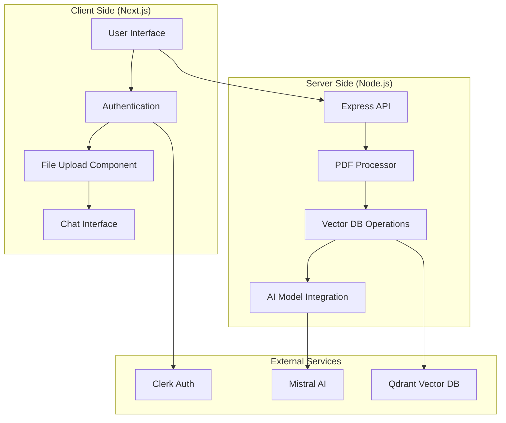
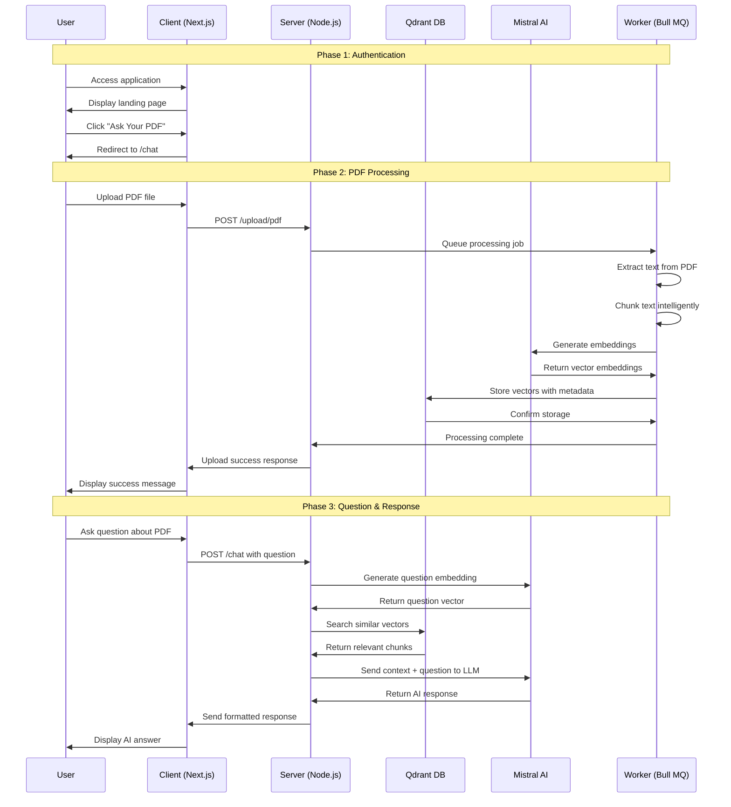

# PaperWise Application Flow 🔄

> **Comprehensive Step-by-Step Process from User Input to AI Response**

This document provides a detailed breakdown of how PaperWise processes user interactions, from initial PDF upload to delivering intelligent AI responses.

## 📋 Table of Contents

1. [System Overview](#system-overview)
2. [Phase 1: User Authentication & Landing](#phase-1-user-authentication--landing)
3. [Phase 2: PDF Upload & Processing](#phase-2-pdf-upload--processing)
4. [Phase 3: Question Processing & AI Response](#phase-3-question-processing--ai-response)
5. [Technology Stack Mapping](#technology-stack-mapping)
6. [Error Handling & Edge Cases](#error-handling--edge-cases)
7. [Performance Optimizations](#performance-optimizations)

---

## 🎯 System Overview



---

## 🔐 Phase 1: User Authentication & Landing

### Step 1.1: Initial Page Load
**Technology**: Next.js, React, Tailwind CSS

```
User Browser → Next.js App Router → layout.tsx → page.tsx
```

**Process**:
1. User navigates to `http://localhost:3000`
2. Next.js App Router loads the root layout (`app/layout.tsx`)
3. Renders the main page (`app/page.tsx`) with Hero component
4. Tailwind CSS applies styling and responsive design

**Components Involved**:
- `app/layout.tsx` - Main application layout
- `app/page.tsx` - Landing page
- `components/Hero.tsx` - Hero section with call-to-action
- `components/Navbar.tsx` - Navigation component

### Step 1.2: User Authentication
**Technology**: Clerk, Next.js Middleware

```
User Click "Sign In/Up" → Clerk Auth Flow → middleware.ts → Protected Routes
```

**Process**:
1. User clicks authentication button in Navbar
2. Clerk handles OAuth/email authentication
3. `middleware.ts` validates authentication status
4. Redirects authenticated users or protects routes
5. Sets user session and context

**Files Involved**:
- `middleware.ts` - Route protection and auth validation
- `app/(auth)/sign-in/[[...sign-in]]/page.tsx` - Sign-in page
- `app/(auth)/sign-up/[[...sign-up]]/page.tsx` - Sign-up page

---

## 📄 Phase 2: PDF Upload & Processing

### Step 2.1: Navigation to Chat Interface
**Technology**: Next.js App Router

```
Authenticated User → "Ask Your PDF" Button → /chat Route → Chat Page
```

**Process**:
1. User clicks "Ask Your PDF" from Hero component
2. Next.js router navigates to `/chat`
3. Loads `app/chat/page.tsx`
4. Renders ChatBox and FileUpload components

### Step 2.2: File Selection & Validation
**Technology**: React, HTML5 File API

```
User Selects PDF → File Validation → Upload Preparation
```

**Process**:
1. User clicks upload area in `FileUpload.tsx` component
2. Browser opens file dialog (HTML5 File API)
3. User selects PDF file
4. Client-side validation:
   - File type validation (PDF only)
   - File size limits
   - File integrity checks

**Component**: `components/FileUpload.tsx`

### Step 2.3: File Upload to Server
**Technology**: FormData API, Fetch API, Express.js

```
Client FormData → HTTP POST /upload/pdf → Express Server → Multer Middleware
```

**Process**:
1. FileUpload component creates FormData object
2. Sends POST request to `${NEXT_PUBLIC_SERVER_URL}/upload/pdf`
3. Express server receives request
4. Multer middleware processes multipart/form-data
5. File saved to `server/uploads/` directory
6. Returns upload confirmation with file ID

**Backend Files**:
- `server/index.js` - Express server setup and routes
- Upload endpoint handler

### Step 2.4: PDF Text Extraction
**Technology**: PDF processing libraries (likely pdf-parse or similar)

```
Uploaded PDF → PDF Parser → Raw Text Extraction → Text Cleanup
```

**Process**:
1. Server receives uploaded PDF file
2. PDF processing library extracts raw text
3. Text cleanup and formatting:
   - Remove special characters
   - Handle line breaks and spacing
   - Extract metadata (title, author, etc.)
4. Store raw text temporarily

**Technology Stack**:
- PDF parsing library (pdf-parse, pdf2pic, or similar)
- Text processing utilities
- File system operations

### Step 2.5: Text Chunking Strategy
**Technology**: LangChain, Custom chunking algorithms

```
Raw Text → Intelligent Chunking → Overlapping Segments → Metadata Assignment
```

**Process**:
1. Divide extracted text into meaningful chunks
2. Apply chunking strategy:
   - **Semantic Chunking**: Break at sentence/paragraph boundaries
   - **Size-based Chunking**: Maintain optimal chunk size (typically 500-1000 tokens)
   - **Overlapping Windows**: Create overlapping segments for context preservation
3. Assign metadata to each chunk:
   - Source document ID
   - Page number
   - Chunk index
   - Timestamp

### Step 2.6: Vector Embedding Generation
**Technology**: Mistral AI Embeddings, LangChain

```
Text Chunks → Mistral Embedding Model → Vector Representations → Normalization
```

**Process**:
1. Send each text chunk to Mistral AI embedding endpoint
2. Generate high-dimensional vectors (typically 1024-4096 dimensions)
3. Normalize vectors for optimal similarity calculations
4. Batch processing for efficiency
5. Handle rate limiting and retries

**API Integration**:
- Mistral AI Embeddings API
- Vector normalization algorithms
- Batch processing queues

### Step 2.7: Vector Database Storage
**Technology**: Qdrant Vector Database

```
Vector Embeddings → Qdrant API → Vector Storage → Index Creation
```

**Process**:
1. Connect to Qdrant vector database
2. Create collection for document vectors
3. Store vectors with metadata:
   - Vector data
   - Original text chunk
   - Document metadata
   - Timestamp
4. Create searchable indexes
5. Optimize for similarity search

**Database Operations**:
- Collection management
- Vector insertion
- Index optimization
- Metadata storage

### Step 2.8: Background Processing with Bull MQ
**Technology**: Bull MQ, Redis (implied)

```
Upload Task → Bull MQ Queue → Worker Process → Progress Updates
```

**Process**:
1. Add PDF processing task to Bull MQ queue
2. `worker.js` processes tasks in background
3. Real-time progress updates:
   - Text extraction progress
   - Chunking completion
   - Embedding generation status
   - Vector storage confirmation
4. WebSocket or polling for progress updates

**Files Involved**:
- `server/worker.js` - Background job processing
- Bull MQ job queue management

---

## 💬 Phase 3: Question Processing & AI Response

### Step 3.1: User Question Input
**Technology**: React, Controlled Components

```
User Types Question → React State Management → Input Validation → Submit Preparation
```

**Process**:
1. User types question in ChatBox component
2. React manages input state
3. Input validation and sanitization
4. Prepare question for submission

**Component**: `components/ChatBox.tsx`

### Step 3.2: Question Submission
**Technology**: Fetch API, Express.js

```
User Question → HTTP POST /chat → Express Route Handler → Question Processing
```

**Process**:
1. ChatBox submits question via POST to `/chat` endpoint
2. Include user authentication token
3. Server validates request and user permissions
4. Extract question text and user context

### Step 3.3: Question Embedding
**Technology**: Mistral AI Embeddings

```
User Question → Mistral Embedding → Question Vector → Similarity Search Preparation
```

**Process**:
1. Send user question to Mistral AI embedding endpoint
2. Generate vector representation of the question
3. Use same embedding model as document processing
4. Normalize question vector for consistency

### Step 3.4: Semantic Similarity Search
**Technology**: Qdrant Vector Database

```
Question Vector → Qdrant Similarity Search → Relevant Chunks Retrieval → Ranking
```

**Process**:
1. Perform vector similarity search in Qdrant
2. Search parameters:
   - Cosine similarity calculation
   - Top-k results (typically 3-5 most relevant chunks)
   - Minimum similarity threshold
3. Retrieve matching text chunks with metadata
4. Rank results by relevance score

**Search Algorithm**:
- Vector similarity calculation
- Relevance scoring
- Result filtering and ranking

### Step 3.5: Context Preparation
**Technology**: LangChain, Custom prompt engineering

```
Retrieved Chunks → Context Assembly → Prompt Construction → Token Management
```

**Process**:
1. Combine relevant text chunks into coherent context
2. Arrange chunks by relevance score
3. Construct prompt with:
   - System instructions
   - Retrieved context
   - User question
   - Response guidelines
4. Manage token limits for AI model

**Prompt Engineering**:
- Context organization
- Token optimization
- Instruction clarity

### Step 3.6: AI Response Generation
**Technology**: Mistral AI Language Model

```
Prompt + Context → Mistral AI LLM → Raw Response → Post-processing
```

**Process**:
1. Send constructed prompt to Mistral AI
2. Model parameters:
   - Temperature settings for creativity/consistency
   - Maximum tokens for response length
   - Stop sequences if needed
3. Receive raw AI response
4. Post-process response:
   - Format cleanup
   - Fact verification against context
   - Citation addition if needed

**AI Integration**:
- Mistral AI API calls
- Response optimization
- Quality assurance

### Step 3.7: Response Delivery
**Technology**: Express.js, JSON formatting

```
AI Response → Format Response → HTTP Response → Client Display
```

**Process**:
1. Format AI response for client consumption
2. Include metadata:
   - Response timestamp
   - Source references
   - Confidence score
3. Send JSON response to client
4. Handle any errors or edge cases

### Step 3.8: Client-Side Display
**Technology**: React, State Management

```
Server Response → React State Update → Component Re-render → User Display
```

**Process**:
1. ChatBox component receives response
2. Update conversation state
3. Re-render chat interface
4. Display AI response with:
   - Proper formatting
   - Timestamp
   - Source indicators
   - Conversation flow

---

## 🛠️ Technology Stack Mapping

### Frontend Technologies
| Component | Technology | Responsibility |
|-----------|------------|----------------|
| **User Interface** | React + Next.js | Component rendering, state management |
| **Routing** | Next.js App Router | Page navigation, protected routes |
| **Styling** | Tailwind CSS | Responsive design, animations |
| **Authentication** | Clerk | User management, session handling |
| **File Upload** | HTML5 File API | File selection, validation |
| **HTTP Requests** | Fetch API | Server communication |
| **Icons** | Lucide React | UI iconography |

### Backend Technologies
| Component | Technology | Responsibility |
|-----------|------------|----------------|
| **Server Framework** | Express.js | API endpoints, middleware |
| **Runtime** | Node.js | JavaScript execution environment |
| **File Processing** | Multer | Multipart form handling |
| **PDF Processing** | PDF parsing libraries | Text extraction |
| **Job Queue** | Bull MQ | Background task processing |
| **Text Processing** | LangChain | Chunking, prompt management |
| **Vector Operations** | Qdrant SDK | Vector storage and search |
| **AI Integration** | Mistral AI SDK | Embeddings and text generation |

### External Services
| Service | Purpose | Integration Point |
|---------|---------|------------------|
| **Mistral AI** | Embeddings & LLM | API calls for vector generation and text completion |
| **Qdrant** | Vector Database | Vector storage and similarity search |
| **Clerk** | Authentication | User management and session handling |

---

## ⚠️ Error Handling & Edge Cases

### File Upload Errors
- **Invalid file type**: Client-side validation with user feedback
- **File too large**: Size limit enforcement and error messaging
- **Upload failure**: Retry mechanism and error reporting
- **Processing timeout**: Background job timeout handling

### AI Service Errors
- **API rate limits**: Exponential backoff and queuing
- **Service unavailability**: Fallback mechanisms and user notification
- **Token limits**: Intelligent chunking and context management
- **Response quality**: Validation and fallback responses

### Database Errors
- **Connection issues**: Retry logic and health checks
- **Storage limits**: Monitoring and cleanup strategies
- **Search failures**: Graceful degradation and error messaging

---

## ⚡ Performance Optimizations

### Client-Side Optimizations
- **Code Splitting**: Next.js automatic code splitting
- **Image Optimization**: Next.js image component
- **Caching**: Browser caching and CDN integration
- **Lazy Loading**: Component and route-based lazy loading

### Server-Side Optimizations
- **Connection Pooling**: Database connection optimization
- **Caching**: Redis caching for frequent queries
- **Batch Processing**: Efficient vector operations
- **Load Balancing**: Horizontal scaling capabilities

### AI & Vector Optimizations
- **Embedding Caching**: Store frequently used embeddings
- **Batch Embeddings**: Process multiple chunks together
- **Index Optimization**: Qdrant index tuning for faster searches
- **Context Caching**: Cache context for similar questions

---

## 🔄 Complete Flow Summary



---

## 📈 Metrics & Monitoring

### Key Performance Indicators
- **Upload Success Rate**: Percentage of successful PDF uploads
- **Processing Time**: Average time from upload to ready-for-questions
- **Response Accuracy**: Quality of AI responses (user feedback)
- **Response Time**: Average time from question to answer
- **System Uptime**: Overall service availability

### Monitoring Points
- **File Processing Queue**: Bull MQ job monitoring
- **Vector Database Performance**: Qdrant query performance
- **AI API Usage**: Mistral AI request tracking and cost monitoring
- **Error Rates**: Application error tracking and alerting

---

*This document provides a comprehensive view of the PaperWise application flow. Each phase represents a critical part of the user journey from PDF upload to receiving intelligent AI responses.*
